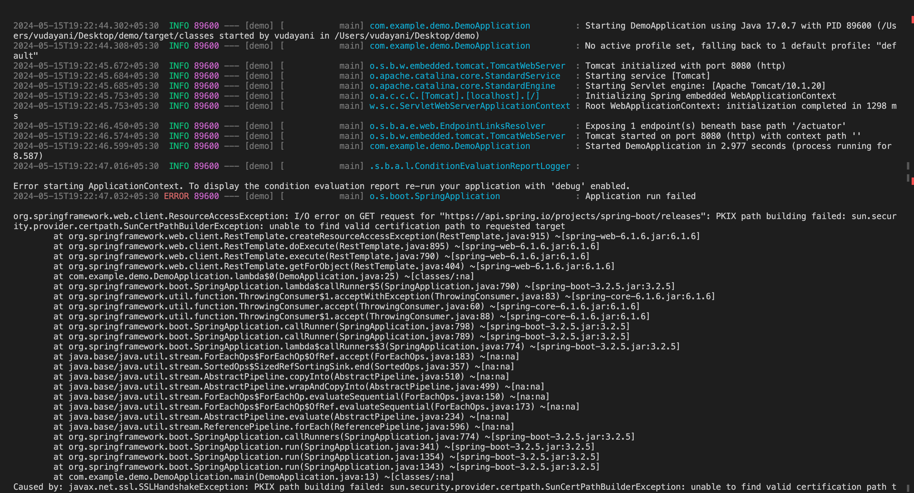
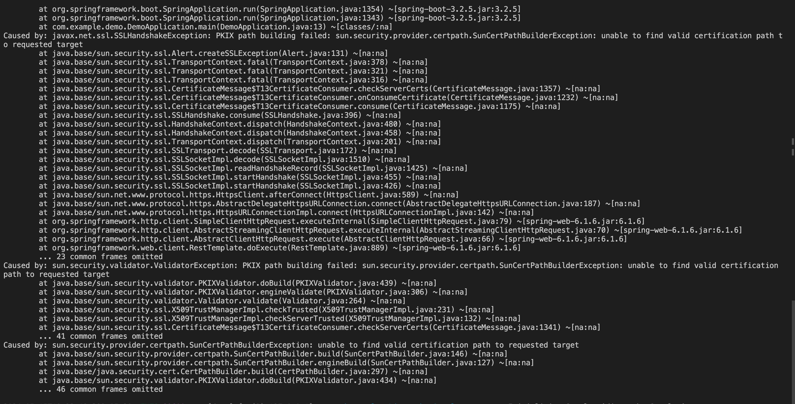

# Spring Releases Fetcher

This application fetches the release data of Spring Boot from the Spring API on startup.

### Prerequisites

- Java 8 or higher
- Maven

### Running the application 

To run the application, use the following command in the terminal:

```bash 
mvn clean install
mvn spring-boot:run
```

The application will start and fetch the Spring Boot releases data from the Spring API.

### Problems Encountered

The application throws the below error when started. Possibily caused by Symmantec WSS agent checks running in the local system.



